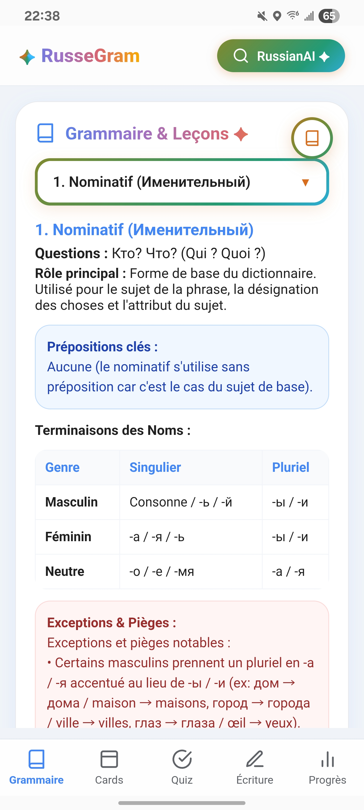
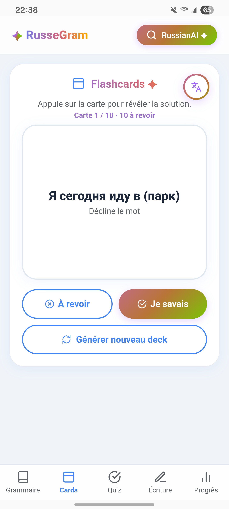
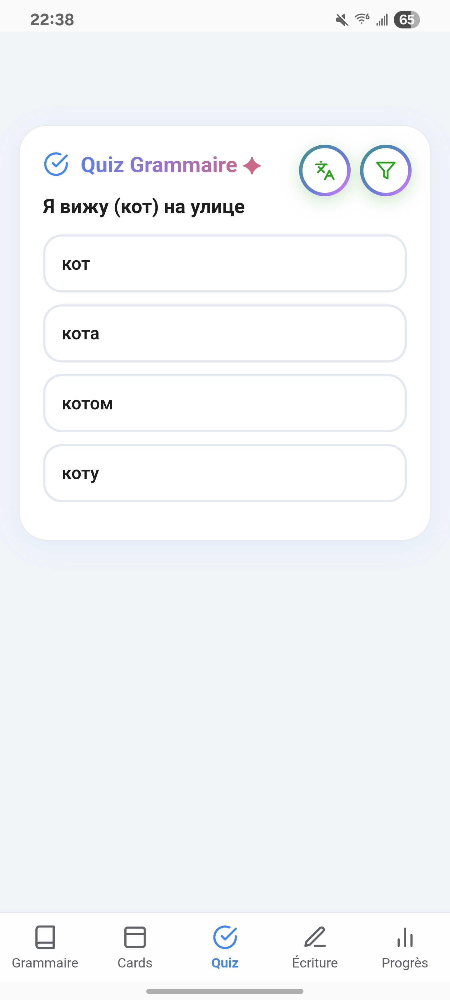
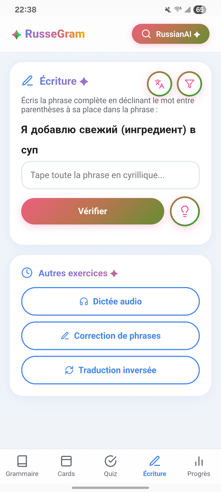
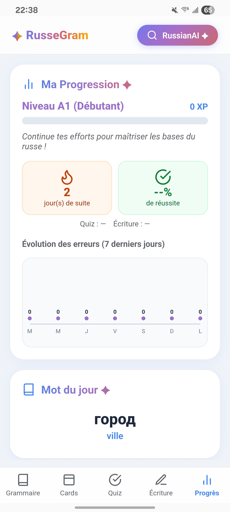
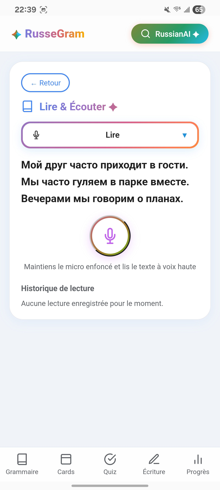
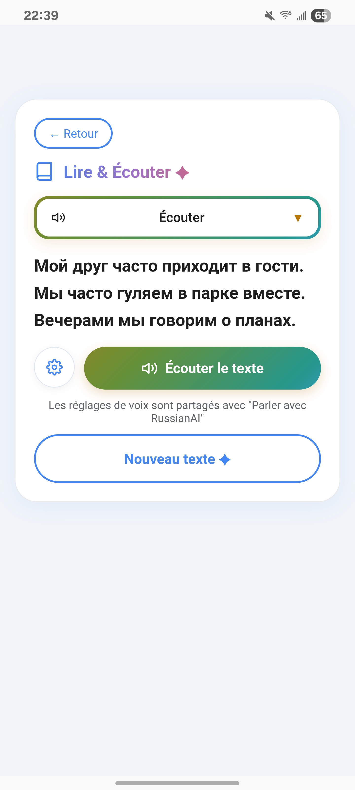
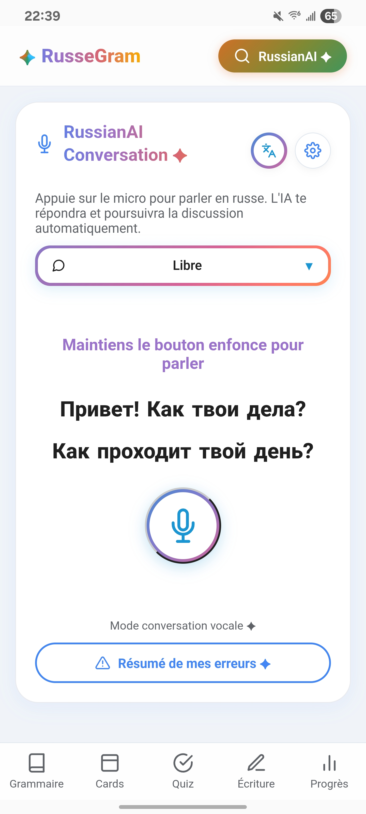
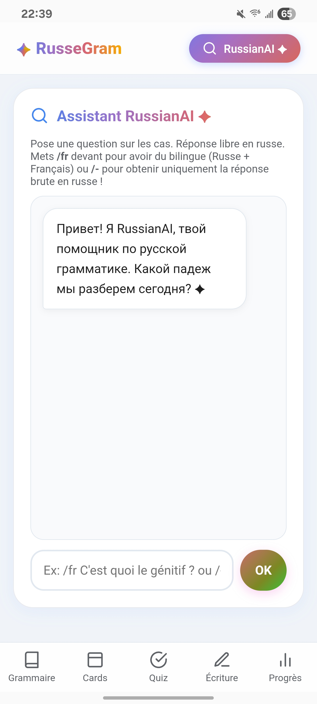

# 🇷🇺 RussGram

> A modern Android app for learning Russian through grammar, vocabulary, reading, listening, writing, and AI-powered practice.

RussGram is a personal learning project designed to make Russian easier to study through interactive exercises and a clean, mobile-friendly interface.

---

## 📑 Table of Contents

- [Features](#-features)
- [Interface](#-interface)
- [Tech Stack](#️-tech-stack)
- [Internet Connection](#-internet-connection)
- [Disclaimer](#️-disclaimer)
- [Screenshots](#-screenshots)
- [Installation](#-installation)
- [Roadmap](#️-roadmap)
- [English Version](#-english-version)
- [Contributing](#-contributing)
- [License](#-license)

---

## ✨ Features

- **📚 Grammar & Lessons** — Russian cases, noun declensions, gender/number, pronouns, adjectives, verb conjugation, prepositions, common exceptions, examples in Russian with French explanations.
- **🃏 Flashcards** — tap a card to reveal the answer, mark words as known/needing review, generate a new deck.
- **🧠 Grammar Quiz** — multiple-choice questions focused on practical grammar usage.
- **✍️ Writing Exercises** — sentence completion, declension exercises, sentence correction, reverse translation, audio dictation, with hints and corrections.
- **📖 Reading** — Russian texts to practice vocabulary, sentence structure, and grammar in context.
- **🎧 Listening** — audio dictation, listening to words/sentences, spoken comprehension, pronunciation, AI-generated texts.
  > ⚠️ Voice generation uses **Microsoft Edge TTS** (an external service): a short delay is normal depending on text length and network conditions.
- **🤖 RussianAI** — an assistant focused on Russian grammar: questions, explanations, translations, examples, exercises, corrections.
- **🗣️ RussianAI Conversation** — practice spoken Russian with AI-generated replies and automatic conversation flow, through a dedicated voice interface.
- **📈 Progress Tracking** — XP, levels, streaks, quiz/writing results, success rate, error statistics, **Word of the Day**.
- **📱 Android Widget** — quick access from the home screen.

---

## 🎨 Interface

Bottom navigation bar, rounded cards, animated transitions, gradient accents, a dedicated RussianAI interface — designed for Android smartphones.

---

## 🛠️ Tech Stack

| Technology | Role |
|---|---|
| Kotlin | Core Android application logic |
| Android Studio | Development environment |
| Android WebView | Hosting the web-based interface |
| HTML / CSS / JS | Interface structure, styling, interactivity |
| LocalStorage | Local data persistence |
| Android AppWidget | Home screen widget |
| Microsoft Edge TTS | Voice generation |
| AI services | RussianAI assistant & conversation mode |

---

## 🌐 Internet Connection

Require Internet: RussianAI, AI-generated exercises, voice generation, audio dictation, AI conversations, external translation services.
Some features can work locally, depending on the available content.

---

## ⚠️ Disclaimer

RussGram is an educational project and is not intended to replace a teacher or a structured language course. AI-generated content may occasionally contain mistakes — always verify important information. Voice generation (Edge TTS) may take some time.

---

## 📸 Screenshots

| Grammar | Flashcards | Quiz |
|---|---|---|
|  |  |  |

| Writing | Progress |
|---|---|
|  |  |

| Reading | Listening |
|---|---|
|  |  |

| RussianAI Conversation | RussianAI Assistant |
|---|---|
|  |  |

---

## 🚀 Installation

```bash
git clone https://github.com/pufferIV/RussGram.git
```

Open the project in **Android Studio**, sync Gradle, then build/run.
Or download the latest APK from the **Releases** section.

---

## 🗺️ Roadmap

- [ ] More grammar lessons
- [ ] Additional vocabulary decks
- [ ] More reading and listening exercises
- [ ] Improved AI corrections
- [ ] More conversation features
- [ ] Better offline support
- [ ] Additional voice options
- [ ] More detailed statistics
- [ ] Interface improvements

---

## 🌍 English Version

The application is currently designed in French. An English version is planned, possibly through community contributions for translation.

---

## 🤝 Contributing

Bug reports, suggestions, translations, content, testing, interface improvements, and code contributions are all welcome.

---

## 📄 License

Personal project currently in development — the license will be specified in a future release.

---

<p align="center">
Made with ❤️ for Russian learners.<br>
<strong>RussGram — Learn Russian, one step at a time</strong>
</p>
